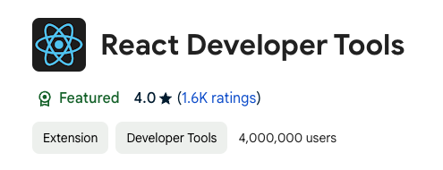

# React-Fundamental

## Chapter1: Introduction to React 

### 1.1 Useful Links

JavaSript Documentation: [MDN](https://developer.mozilla.org/en-US/)

CN CDN Library: [Boot CDN](https://bootcdn.cn)

EN React Documentation: [React](https://react.dev)

CN React Documentation: [React](https://react.docschina.org)


### 1.2 React Theory

**React**: An open-source JavaScript library for rendering data into HTML views, primarily used for building user interfaces. It enables the creation of reusable UI components and efficiently updates the view when data changes.

- **Component-Based Structure & Declarative Coding**
  - Break down a page or application into independent, reusable components, each serving a specific function and able to be developed, tested, and reused separately
  - Define what the UI should look like at any given time, and React takes care of updating it when the data changes
  - Increase development efficiency and component reusability

- **Mobile Development with React Native**
  - React syntax can be used in React Native for mobile app development.
- **Virtual DOM & Diffing Algorithm *(Why React is Efficient)***
  - Minimise interactions with the real DOM by comparing virtual DOM snapshots and only updating what’s necessary
  - Reduce the expense of page re-rendering by avoiding direct manipulation of the real DOM whenever possible.


### 1.3 Basic Knowledge

#### 1.3.1 **React JS Libraries**

```html
<!-- Import React Core Library -->
<script src="https://unpkg.com/react@18/umd/react.development.js"></script>
<!-- Import React-DOM for DOM operation -->
<script src="https://unpkg.com/react-dom@18/umd/react-dom.development.js"></script>
<!-- Import babel for transfering jsx to js -->
<script src="https://unpkg.com/@babel/standalone/babel.min.js"></script>

<!-- Import prop-types for prop type checking -->
<script src="https://unpkg.com/prop-types/prop-types.js"></script>
```


#### 1.3.2 **JSON**

- **parse**: Converts a JSON-formatted string into a JavaScript object.

  ```javascript
  const jsonString = '{"name": "Alice", "age": 25}';
  const obj = JSON.parse(jsonString);
  // Access properties: obj.name, obj.age
  ```

- **stringify**: Converts a JavaScript object or value into a JSON-formatted string.

  ```javascript
  const obj = { name: "Alice", age: 25, isStudent: false };
  const jsonString = JSON.stringify(obj);
  console.log(jsonString); 
  // Output: {"name":"Alice","age":25,"isStudent":false}
  ```


#### 1.3.3 **Virtual DOM and Real DOM**

- **Virtual DOM vs Real DOM**:  
  - <u>The Virtual DOM</u> is a lightweight JavaScript object representation of the Real DOM, managed by React.
  - <u>The Real DOM</u> directly interacts with the browser to display and update content but is slower to manipulate.
- **Creation and Structure**:  
  - React APIs, like `ReactDOM.createRoot`, create a Virtual DOM instance as a special JavaScript object.
  - The Virtual DOM is simpler and <u>contains fewer properties</u> than the Real DOM, making it faster to process.
- **Efficiency**:  
  - The Virtual DOM is "<u>light</u>," while the Real DOM is "<u>heavy</u>" and costly to update.
  - React uses the Virtual DOM to track changes before updating the Real DOM, reducing the workload for the browser.
- **Developer Interaction**:  
  - During development, we mainly work with the Virtual DOM; React automatically handles the conversion to Real DOM updates for final display.


#### 1.3.4 **JSX Syntax**

- **Basic Syntax Rules**  
  - Code starting with `<` is parsed as a tag:
    - Standard HTML tags convert directly to corresponding HTML elements.
    - Non-standard tags require custom parsing.
  - Code inside `{}` is parsed as JavaScript:
    - JS expressions within tags must be enclosed in `{}`.

- **JavaScript Expressions**  
  - Expressions produce a value and can be used wherever a value is needed, such as:
    - `a`
    - `a + b`
    - `arr.map()`
    - `function test(){}`

- **JavaScript Statements (Code)**  
  - Statements control flow but don’t produce a value, like:
    - `if (){}`
    - `for (){}`
    - `switch (){}`

- **Role of `babel.js`**  
  - Browsers cannot directly parse JSX; Babel translates JSX into JavaScript for browser compatibility.
  - When using JSX, add `type="text/babel"` to indicate Babel processing is required.

- **Other JSX Guidelines**  
  - Use `className` instead of `class` for CSS classes.
  - Write inline styles as `style={{ key: 'value' }}`.
  - JSX must have a single root tag.
  - Tags must be self-closing or explicitly closed.

- **Tag Naming Conventions**  
  - **Lowercase**: Interpreted as an HTML element (e.g., `<div>`). If no matching HTML element exists, an error is thrown.
  - **Uppercase**: Interpreted as a React component. An error occurs if the component is undefined.


#### 1.3.5 Rendering Virtual DOM

```jsx
<div id="root"></div>

<script type="text/babel">
  class App extends React.Component {
    render() {
      return (
        <div>Hello, Welcome Back!</div>
      );
    }
  }

  // Select the real DOM container and create a root instance for rendering
  const root = ReactDOM.createRoot(document.getElementById('root'));
  // Render the App component's virtual DOM into the real DOM container
  root.render(<App />);
</script>
```


### **1.4 Modularisation vs. Componentisation**

#### 1.4.1 **Modules**

- **Definition**: A JavaScript program that provides specific functionality, typically a single JavaScript file.
- **Why use modules?**: As business logic grows, code becomes larger and more complex. Breaking it into modules helps manage this complexity.
- **Purpose**: To reuse JavaScript code, simplify code structure, and improve runtime efficiency.
- **Modularisation**: When all JavaScript in an application is written as modules, the application is considered modular.


#### 1.4.2 **Components**

- **Definition**: A collection of code and resources (HTML, CSS, JS, etc.) that implements specific functionality for a specific section of a page.
- **Why use components?**: To handle more complex functionality within a user interface.
- **Purpose**: To enable code reuse, simplify project structure, and improve runtime efficiency.
- **Componentisation**: When an application is built using multiple components, it is considered a component-based application.


## Chapter2: Component-Oriented Programming in React

### 2.1 Basic Knowledge and Usage

#### 2.1.1 React Developer Tools for Debugging



#### **2.1.2 Function / Class Components**

- Function Component

```jsx
// 1. Define a functional component
function MyComponent() {
  return <h2>This is a functional component (suitable for simple components)</h2>;
}

// 2. Select the root container and render the component
import React from 'react';
import ReactDOM from 'react-dom/client';

const root = ReactDOM.createRoot(document.getElementById('root'));
root.render(<MyComponent />);

/*
Explanation:
1. React parses the component tag and identifies it as a custom functional component.
2. It calls the MyComponent function, converting the returned virtual DOM into real DOM elements, which are then displayed on the page.
*/
```

- Class Component

```jsx
//1.创建类式组件
class myComponent extends React.Component{
  //render(): 放在myComponent的原型对象上供实例使用
  //this: myComponent组件实例对象
  render(){
    return (<h2>我是用类定义的组件（适用于【复杂组件】的定义）</h2>)
  }
}
//2.渲染组件到页面
ReactDOM.render(<myComponent/>, document.getElementById('id'));

/*
1.React解析组件标签，找到myComponent组件。
2.发现组件是类定义的，随后new出该类的实例，并通过该实例调用原型的render方法。
3.将render返回的虚拟DOM转换为真实DOM，随后呈现在页面中
4.props, refs, state组件的三大属性
*/
```


#### **class复习**

```javascript
class Person {
  constructor(name, age) {
    this.name = name;
    this.age = age;
  }
  speak() {
    console.log(`My name is ${this.name}, I am ${this.age} years old.`);
  }
}

class Student extends Person {
  constructor(name, age, grade) {
    super(name, age);
    this.grade = grade;
  }
  speak() {
    console.log(
      `My name is ${this.name}, I am ${this.age} years old in Year ${this.grade}.`
    );
  }
}

const s1 = new Student('Yuc', 24, 'Graduated');
s1.speak();

/*
1.类中的构造器不是必须写的，要对实例进行一些初始化操作，如添加指定属性时才写。
2.如果A类继承B类，且A类中写了构造器，那么A类的构造器中的super是必须调用的。
3.类中所定义的方法，都放在了类的原型对象上，供实例去使用。（子类特有的方法会在子类的原型对象上）
*/
```


### **组件实例的三大核心**

- state
- props
- ref

Function Component没有this，没有实例化，没有这三大核心


#### **State**

**定义**: `state` 是组件的“内部数据”，由组件自己维护。

**作用**: `state` 用来保存组件内部的状态信息，可以通过事件或其他操作修改状态，从而更新界面。

**特点**: `state` 是可变的，组件可以通过 `setState` 或 `useState` 来修改它的值。

理解：

1. state的值是一个对象，包含多个key-value的组合。
2. 组件被称为“状态机”，通过更新组件的state来更新对应的页面显示（重新渲染组件）。

**强烈注意：**

1. 组件中的render方法中的this为组件实例对象。

2. 组件自定义的方法中的this为undefined，如何解决？

   - 强制绑定this：通过函数对象的bind()

     ```jsx
     this.changeWeather = this.changeWeather.bind(this);
     ```

   - 赋值语句 + 箭头函数

     ```jsx
     changeWeather = () => {
       this.setState({isHot:!this.state.isHot});
     }
     ```

   - 调用

     ```jsx
     <h1 onClick={this.changeWeather}>Today's weather is {this.state.isHot ? 'hot' : 'cool'}.</h1>
     ```

3. 状态数据不能直接修改或更新，必须使用`set.state()`

   ```jsx
   /* 定义与使用 */
   state = {
     count: 0
   };
   increment = () => {
     this.setState({ count: this.state.count + 1 });
   };
   
   this.setState({isHot:!this.state.isHot});
   ```
   


#### **Props**

**定义**: `props` 是组件的“外部数据”，由父组件传递给子组件。

**作用**: `props` 用来让组件接收外部的数据，组件不能直接修改这些数据，只能读取和使用。

**特点**: `props` 是不可变的，组件内部不能改变它的值。

1. 关于`...`展开运算符

```jsx
const user = { name: 'John', age: 25 };
const MyComponent = () => {
    return <UserProfile {...user} />;
};

/*
1.这里的{}是说要使用js语法了
2.使用...user 直接展开 user 对象并将它的属性传递给 UserProfile 组件。这是 JSX 的特性。
*/
```

```javascript
const user = { name: 'John', age: 25 };

// 正确的对象展开用法，用一个{}包裹
const newUser = { ...user, location: 'NY' };
console.log(newUser); // { name: 'John', age: 25, location: 'NY' }

// 错误的对象展开方式（会报错）
const result = ...user; // SyntaxError: Unexpected token ...

/*
1.在原生 JavaScript 中，展开对象时需要用 {} 包裹。{...user} 是将 user 对象的所有属性展开到一个新的对象中。
2.如果直接使用 ... 展开对象而不在 {} 中，会导致语法错误。
*/
```


2. 关于classComponent的**propTypes和defaultProps**

```html
<!-- Import prop-types for prop type checking -->
<script src="https://unpkg.com/prop-types/prop-types.js"></script>
```

```jsx
// Example of 	propTypes: define prop types
//							defaultProps: set default value
Person.propTypes = {
  name: PropTypes.string.isRequired,
  age: PropTypes.number,
  gender: PropTypes.string,
  speak: PropTypes.func
};
Person.defaultProps = {
  age: 0,
  gender: "N/A"
};

/*
1.如果是类式组件的话，和 static 搭配使用，可以写在 class component 里面。
2.函数式组件是能写在外面。
3.类式组件，注意PropTypes 'prop-types' propTypes的区别
*/

import PropTypes from 'prop-types'
export default class List extends Component {
  static propTypes = {
    todos: PropTypes.array.isRequired,
    updatetodos: PropTypes.func.isRequired,
    deletetodo: PropTypes.func.isRequired
  }
}

```


3. 函数组件使用props

```jsx
function Person(props) {
    const {name, age, gender} = props;
    return (
        <>
            <ul>
                <li>Name: {name}</li>
                <li>Age: {age}</li>
                <li>Gender: {gender}</li>
            </ul>
        </>
    )
}
```


#### Refs 与事件处理

##### refs

1. React refs 的使用，有 createRef() 和 回调形式 两种方法使用 ref，字符串形式不被推荐使用

```jsx
class MyRefComponent extends React.Component {
  //1.createRef() 调用后返回一个容器，可以用于储存被 ref 所标识的节点，该容器“专人专用”。
  input1 = React.createRef();
  input2 = React.createRef();
  //2.使用 .current 来获取真实 DOM 元素。
  Display1 = () => {
    const input1 = this.input1.current;     //获取真实DOM但不使用Doument.getElementBy...方法
                                            //.current 指向的是你所引用的实际 DOM 元素。
    alert(input1.value);
  }
  Display2 = () => {
    const input2 = this.input2.current;
    alert(input2.value);
  }
  render() {
    return (
      <>
      <input ref={this.input1} placeholder="Click button alert input" type="text" />
      <button onClick={this.Display1}>Click me to display data on the left </button>
      <input ref={this.input2} onBlur={this.Display2} placeholder="Alter data when blur"/>
      </>
    )
  }
}
const root = ReactDOM.createRoot(document.getElementById('root'));
root.render(
  <>
  <MyRefComponent />
  </>
);

/*
1.createRef() 调用后返回一个容器，可以用于储存被 ref 所标识的节点，该容器“专人专用”。
2.使用 this.<REFNAME>.current 来获取真实 DOM 元素。
3.标签中添加属性 ref={this.<REFNAME>}。
*/
```

- `ref` 请勿过度使用


##### event.target事件处理

2. 事件处理

1. 通过 `onXxx` 属性指定事件处理函数（注意大小写）

   - React 使用的是自定义合成事件，而不是使用原生的 DOM 事件 —— 更好的兼容性
   - React中的事件是通过事件委托方式处理的，委托给组件最外层的元素 —— 高效
     - React 通过事件委托将事件绑定到根元素，当子元素触发事件时，事件冒泡到根元素，由根元素根据 `event.target` 确定并执行对应的事件处理函数。

2. 通过 `event.target` 得到发生事件的 DOM 元素对象

   - 发生事件的元素正好是我要操作的元素，就可以省略ref

   ```jsx
   class MyEventComponent extends React.Component {
     Display = (event) => {
       alert(event.target.value);
     }
     render() {
         return (
           <>
           <input onBlur={this.Display} placeholder="Alter data when blur" />
           </>
         )
     }
   }
   
   /*
   1.event 作为参数传进箭头函数
   */
   ```


### 收集表单数据

#### 非受控组件

理解：在 **非受控组件** 中，表单元素的值由 DOM 自己管理，React 不直接控制表单数据。可以使用 `ref` 获取表单的值，而不是通过 React 的 `state` 来控制输入。

In an **uncontrolled component**, the form elements store their own values in the DOM, and React doesn’t manage the form data. 

- 非受控组件：输入类 DOM，值现用现取

```jsx
class UncontrolledComponent extends React.Component {
  username = React.createRef();
  password = React.createRef();
  handleSubmit = () => {
    event.preventDefault();
    alert(`Username: ${this.username.current.value}, Password: ${this.password.current.value}`)
  }
  render() {
      return (
      <form onSubmit={this.handleSubmit}>
          Username: <input ref={this.username} name="username" type="text" />
          Password: <input ref={this.password} name="password" type="text" />
          <button type="submit" >Submit</button>
      </form>
      )
  }
}
```

`event.preventDefault()` : **prevent the default behavior** of an event from occurring.


#### 受控组件

理解：**受控组件**指的是表单元素（如输入框、文本区域等）由组件的 **state**（状态）控制。

A **controlled component** is when the form elements (like input, textarea, etc.) are **controlled by the component's state**.

- 输入类的 DOM 随着值的输入把值维护到状态 state 里面去，用时直接从状态取出来

- 一个 `ref` 都没用，在非受控组件，每一个输入项就需要一个 `ref`。

```jsx
class ControlledComponent extends React.Component {
  //1.使用state现定义state
  state = {
      username: '',
      password: ''
  }
  //2.保存新的值到状态中
  handleUsername = (event) => {
      this.setState({ username: event.target.value })
  }
  //2.保存新的值到状态中
  handlePassword = (event) => {
      this.setState({ password: event.target.value })
  }
  //
  handleSubmit = (event) => {
      event.preventDefault();
      const { username, password } = this.state;
      alert(`Username: ${username}, Password: ${password}`)
  }
  //3.随着输入，把输入值维护到状态中去
  render() {
      return (
          <form onSubmit={this.handleSubmit}>
              Username: <input onChange={this.handleUsername} name="username" type="text" />
              Password: <input onChange={this.handlePassword} name="password" type="text" />
              <button type="submit" >Submit</button>
          </form>
      )
  }
}
```


#### 高阶函数和函数柯里化

- 必须把函数丢给事件处理属性

**高阶函数**

理解：高阶函数是指**可以接收其他函数作为参数，或者返回一个函数作为结果的函数**

```javascript
// 一个高阶函数，接收一个函数作为参数
function higherOrderFunction(fn) {
    return function() {
        console.log('Before executing the function');
        fn();  // 执行传入的函数
        console.log('After executing the function');
    };
}

function sayHello() {
    console.log('Hello, World!');
}

const wrappedFunction = higherOrderFunction(sayHello);
wrappedFunction(); 
```


**函数柯里化**

函数柯里化是指**将一个接受多个参数的函数转换为一系列接受单个参数的函数**。柯里化的函数不会立即执行，它会返回一个函数链，直到所有参数都传递给函数时才会执行

```javascript
// 一个简单的柯里化函数示例
function add(a) {
    return function(b) {
        return a + b;
    };
}
const addFive = add(5);  // 返回一个函数，已经接收了第一个参数5
console.log(addFive(3));  // 输出 8
console.log(add(2)(3));   // 输出 5

/*
解释：add 函数通过柯里化的方式将原来接受两个参数的函数拆分为两个函数。第一次调用时，传入第一个参数并返回一个新的函数。第二次调用时，传入第二个参数并计算结果。
*/
```


### 组件生命周期

#### 基础

React 组件的生命周期分为三个主要阶段：

**挂载阶段（Mounting）**

这是组件第一次被渲染到页面时的阶段。以下是挂载阶段中的主要生命周期方法：

**`render()`**：组件初始化渲染，状态更新之后。

**`componentDidMount()`**：组件第一次渲染或挂载完成后调用，可以在这里发起网络请求或与 DOM 进行交互。


**更新阶段（Updating）**

组件的 props 或 state 发生变化时，会进入更新阶段。以下是更新阶段中的主要生命周期方法：

**`render()`**：根据新的状态或 props 重新渲染组件。


**卸载阶段（Unmounting）**

当组件从 DOM 中移除时，会进入卸载阶段。以下是卸载阶段中的主要生命周期方法：

**`componentWillUnmount()`**：组件即将被卸载和销毁之前调用，可以在这里清理定时器、取消网络请求或清理订阅等。

```jsx
<script type="text/babel">
    // Step1: Create Class Component
    class Life extends React.Component {
        //2.设置opacity
        state = { opacity: 1 }
        //3.设置Timer
        //componentDidMount回调时间：组件挂载完毕
        componentDidMount() {
            this.timer = setInterval(() => {
                let { opacity } = this.state;
                opacity = opacity - 0.1;
                if (opacity <= 0) { opacity = 1 };
                this.setState({ opacity });
            }, 200)
        }

        //4.卸载组件
        delete = () => {
            //过时ReactDOM.unmountComponentAtNode(document.getElementById('root'));
            root.unmount();
        }

        //5.关闭定时器
        //componentWilUnmount回调时间：组件将要卸载
        componentWillUnmount() {
            clearInterval(this.timer);
        }

        //1.定义样式
        //render回调时间：组件初始化渲染，状态更新之后
        render() {
            return (
                <>
                    <h1 style={{ opacity: this.state.opacity }}>Opacity is decreasing!!!</h1>
                    <button onClick={this.delete}>Click me to delete everything</button>
                </>
            );
        }
    }

    // Step2: Render Component
    const container = document.getElementById('root');
    const root = ReactDOM.createRoot(container);
    root.render(<Life />);

</script>
```


**Style中的内联写法**

```jsx
style={{ color: 'red' }}
```

- 最外层的大括号：表示插入 JavaScript 表达式。

- 里面表示CSS 样式对象，其中的键值对表示 CSS 属性和对应的值，格式 `{key: value}`。

- 事件处理函数用 `{this.func}`：传递函数引用，不加 `()`，否则会将函数返回值赋给事件处理函数。


**计时器**

- `setInterval()` 是 JavaScript 的内置函数，用于按照指定的时间间隔，重复执行 一个函数或代码片段，直到被手动停止（通过 `clearInterval()`）。

```javascript
setInterval(function, delay);
/*
1.function：要执行的函数或代码片段。
2.delay：以毫秒为单位的时间间隔（1000 毫秒 = 1 秒）。
*/
```

```javascript
const intervalId = setInterval(() => {
  console.log("Repeating every second");
}, 1000);

// 停止 setInterval
clearInterval(intervalId);

/*
1.保存 setInterval() 返回的 ID 以便进行清除。
2.使用 clearInterval(<ID>) 来停止 setInterval()。
*/
```


**3种 setState 的场景**

1. `this.setState({ opacity })`

   - 这种写法等同于 `this.setState({ opacity: opacity })`。

   - 使用场景：当对象的键和值名称相同时的简写方式。
   - ES6 的对象属性简写

2. `this.setState({ [inputType]: event.target.value }`

   - 计算属性名（ES6 特性），让状态键名可以动态计算。
   - 方括号表示，`inputType` 是一个变量，它的值决定了哪个状态属性会被更新。
   - 使用场景：当变量作为键名

3. `this.setState({ name: newName })`

   - 使用场景：明确更新特定属性（直接指定键名）


#### 生命周期函数顺序

```
初始化阶段
1. constructor()
2. componentWillMount() / UNSAFE_componentWillMount()
3. render()
4. componentDidMount()				====> 常用！做一些初始化的事情，例如开启定时器，发送网络请求，请阅消息等

更新阶段：由组件内部 this.setState() 或父组件 render 触发
1. componentWillReceiveProps() / UNSAFE_componentWillReceiveProps() 父组件 render 触发
2. shouldComponentUpdate() 返回 true/false 决定组件是否更新的阀门
3. componentWillUpdate() / UNSAFE_componentWillUpdate()
4. render()
5. componentDidUpdate(preProps, preState, snapshotValue)

卸载阶段：由 ReactDOM.createRoot() 创建的 root 使用 unmount() 触发
1. componentWillUnmount()			====> 常用！做一些收尾的事情，关闭定时器，取消订阅消息
```


新

```jsx
static getDerivedStateFromProps(props, state){...}
/*
此方法适用于 少数罕见用例，其中 state 取决于 props 随着时间的推移的变化。
*/

getSnapshotBeforeUpdate(prevProps, prevState)
/*
滚动条，scrollHeight 和 scrollTop
*/
                                              
初始化阶段
1. constructor()
2. getDerivedStateFromProps
3. render()
4. componentDidMount()				====> 常用！做一些初始化的事情，例如开启定时器，发送网络请求，请阅消息等

更新阶段：由组件内部 this.setState() 或父组件 render 触发
1. getDerivedStateFromProps
2. shouldComponentUpdate() 返回 true/false 决定组件是否更新的阀门
3. render()
4. getSnapshotBeforeUpdate()
5. componentDidUpdate(preProps, preState, snapshotValue)

卸载阶段：由 ReactDOM.createRoot() 创建的 root 使用 unmount() 触发
1. componentWillUnmount()			====> 常用！做一些收尾的事情，关闭定时器，取消订阅消息
```


## 章节二：Reacrt应用基于React脚手架

**创建项目并启动**

```
npm install -g create-react-app
create-react-app <PROJECT_NAME>
npm start
```

```
yarn start
yarn build			把写完的项目进行最终打包，整个应用写完了
yarn eject			暴露 webpack 配置相关文件，不可逆
```

- 模块化，组件化，工程化

- index.html 中 root div 中只放入一个组件 app.js 的函数组件

  - src/index.js ---> 入口文件
    - 导入了 app.js 中的 app 组件
    - 获取了 index.html 中的 root div
    - 把 app 组件 render 到了 root div 上

- **重要文件**

  - index\.html ----- 主页面
  - App.js ----- App组件
  - index.js ----- 入口文件

- 区分业务逻辑的js和jsx

  - js 业务功能
  - jsx 组件 & 文件名首字母大写

  - js, jsx在 react 引入时可以不写后缀

- /components/<COMPONENT_NAME>/<COMPONENT_NAME>.jsx

  - 这个写法在引入时的引入语句会很繁杂

  - 如果在Component文件夹下使用 index.jsx 的话可以省略一部分如

    ```
    FROM
    import Welcome from './components/Welcome/Welcome'
    TO
    import Welcome from './components/Welcome'
    ```

- Vue, React ---> Single Page Application (SPA)
- 网页 / 客户端 开发
  - Android Java
  - IOS Swift
  - 网页 HTML 使用加壳技术 可以变成安卓/IOS应用


**React VS Code 插件**

ES7+ React/Redux/React-Native snippets

```
rcc - React Class Component
rfc - React Function Component
```


**组件编码流程**

1. 拆分组件: 拆分界面,抽取组件
2. 实现静态组件: 使用组件实现静态页面效果
3. 实现动态组件
   1. 动态显示初始化数据
      1. 数据类型
      2. 数据名称
      3. 保存在哪个组件?
   2. 交互(从绑定事件监听开始)


**文件中导入时**

第三方已经写好的包在最上面

自己写的包往下写

样式在最后


**ToDo List案例知识点**

1. 拆分组件，实现静态组件，注意：className, style的写法
2. 动态初始化列表，如何确定将数据放在哪个组件的state中？
   1. 某个组件使用：放在其自身的state中
   2. 某些组件使用：放在他们共同的父组件state中（官方称此操作：状态提升）
3. 父子组件通信
   1. 【父组件】给【子组件】传递数据：用Props传递
   2. 【子组件】给【父组件】传递数据：父组件把一个函数作为Props传递给子组件 子组件使用传递过来的函数
   3. 祖孙关系的话就通过当中的父组件多传一层
4. 注意defaultChecked和checked的区别，类似的还有：defaultValue 和 value
5. 状态在哪里（哪个组件里面），操作状态的方法就在哪里（可以传出去）
6. 在jsx的html中写函数如果传参注意写高阶函数


## 章节三：React ajax

安装

```
yarn add axios
```

使用

```jsx
import axios from 'axios'
handleClick = () => {
  axios.get('http://localhost:3000/students').then(
      response => {
          console.log('Success', response.data);
      },
      error => {
          console.log('Fail', error);
      }
  )
}

/*
1.数据服务器在 3001 端口
2.自身在 3000 端口
*/
```

在`package.json`中配置proxy代理服务器，跨域请求

```json
"proxy": "http://localhost:3001"
```

在 `setupProxy.js` 文件中，使用` http-proxy-middleware `设置代理服务器

```js
const { createProxyMiddleware } = require('http-proxy-middleware');

module.exports = function (app) {
    app.use(
        '/api1',		//api1是需要转发的请求(所有带有/api1前缀的请求都会转发给3050)
        createProxyMiddleware({
            target: 'http://localhost:3050',		//配置转发目标地址(能返回数据的服务器地址)
            changeOrigin: true,									//控制服务器接收到的请求头中host字段的值
       /*
      	changeOrigin设置为true时，服务器收到的请求头中的host为：localhost:3050 （自身）
      	changeOrigin设置为false时，服务器收到的请求头中的host为：localhost:3000
      	changeOrigin默认值为false，但我们一般将changeOrigin值设为true
      */
            pathRewrite: { '^/api1': '' }				 //去除请求前缀，保证交给后台服务器的是正常请求地址(必须配置)
        })
    );
    app.use(
        '/api2',
        createProxyMiddleware({
            target: 'http://localhost:3051',
            changeOrigin: true,
            pathRewrite: { '^/api2': '' }
        })
    );
};
```


**为什么直接跨域请求不行？**

跨域请求的问题是由**同源策略**（Same-Origin Policy）导致的，这是浏览器的一种安全机制。根据同源策略，浏览器只允许从同一个域（包括协议、域名和端口）的网页发起请求。如果你从一个不同的端口或域名（即使是同一个服务器的不同端口）发起请求，就会被视为跨域请求，浏览器会阻止它，除非目标服务器允许跨域访问。

假设：

- 前端应用运行在 `http://localhost:3000`。
- 后端服务运行在 `http://localhost:3050`。

即使两个服务都在同一个服务器上，但因为端口不同，它们被浏览器认为是**不同的源**，因此跨域请求会被阻止。


### Case2: github search

```jsx
/* 更简便的更新 state 方法 */
state = {
  usersList: [],
  isFirst: true,
  isLoading: false,
  error: ''
};

updateState = (stateObj) => {
  this.setState(stateObj);
}

/* 传入 props */
<Search updateState = {this.updateState}/>
<List {...this.state} usersList = {this.state.usersList} />

/* 使用更新函数 */
this.props.updateState({isFirst: false, isLoading: true});    
this.props.updateState({isLoading: false, usersList: response.data.items});
```

- 设计状态时要考虑全面，例如带有网络请求的组件，要考虑不同时期（请求失败、初次加载、加载中）的效果。
- ES6小知识点：结构赋值 + 重命名

```
let obj = {a: {b: 1}}
const {a} = obj										// Traditional
const {a: {b}} = obj							// Continuious
const {a: {b: value}} = obj				// Continuious + Rename
```

- 消息订阅与发布机制
  1. 先订阅，再发布
  2. 适用于任何组件的通信
  3. 记得在componentWillUnmount中取消

es6

cjs服务器端？

promises 风格 axious

jquery 回调地狱


## 章节四：React Router路由

**基本路由使用**

1. 明确界面的导航区和展示区

2. 导航区的`a`标签改为`Link`标签

   ```html
   <Link to"/XXX">XXX</Link>
   ```

3. 展示区写`Route`标签进行路径匹配

   ```html
   <Route path="/XXX" component={Demo}></Route>
   ```

4. `<App>`的最外侧包裹了一个`BrowserRouter`或`<HashRouter>`

**路由组件与一般组件**

1. 写法不同

   一般组件：`<Demo />`

   路由组件：`<Route path="/Demo" component={Demo} />`

2. 存放位置不同

   一般组件：components

   路由组件：pages

3. 接收到的props不同

   一般组件：不传就为空

   路由组件：

   ```
   history:
   - go: function(n)
   - goBack: function()
   - goForward: function()
   - push: function(path, state)
   - replace: function(path, state)
   
   location:
   - pathname: "/home"
   - search: ""
   - state: undefined
   
   match:
   - params: {}
   - path: "/home"
   - url: "/home"
   ```

**NaviLink与封装NaviLink**

1. `NaviLink`可以实现路由链接的高亮，通过`activeClassName`制定样式名
2. 标签体内容是一个特殊的标签属性
3. 通过`this.props.children`可以获取标签体内容

**Switch组件的使用**

1. 通常情况下，path和component是一一对应的关系
2. Switch包裹Route可以提高路由匹配的效率

**解决多级路径刷新页面样式丢失的问题**

1. public/index.html 中，引入样式时不写 ./ 写 /【常用】

   使用 `/` 代表从网站的根目录开始引用文件

2. public/index.html 中，引入样式时不写 ./ 写 %PUBLIC_URL%【常用】

   它代表项目的公共 URL 根路径

3. 使用HashRouter【不常用】

**路由的严格匹配与模糊匹配**

1. 默认使用模糊匹配

   【输入的路径NaviLink】必须包含要【匹配的路径Route】，且顺序一致（为第一个）

2. 开启严格匹配：`<Route exact={true} path="/about" component={About} />`

3. 不要随便开启严格匹配，需要再开，有些时候开启可能导致无法继续匹配二级路由

**Redirect组件的使用**

1. 一般写在所有路由注册的最下方，当所有路由都无法匹配时，跳转到Redirect制定的路由


```html
{/* 1.编写路由链接 */}
<MyNaviLink to="/about">About</MyNaviLink>
<MyNaviLink to="/home">Home</MyNaviLink>

{/* 2.注册路由，定义关系 */}
<Switch>
  <Route path="/about" component={About} />
  <Route path="/home" component={Home} />
  <Redirect to="/home" />
</Switch>
```


